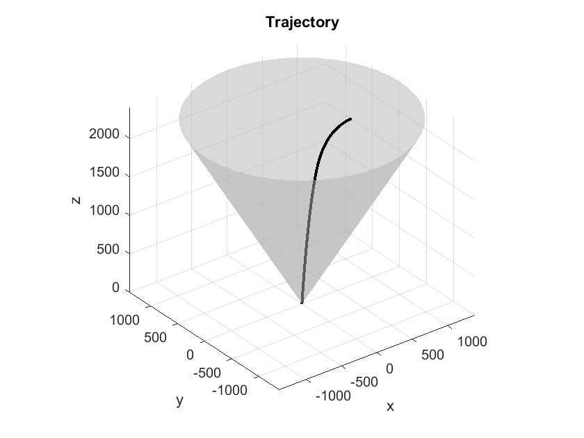
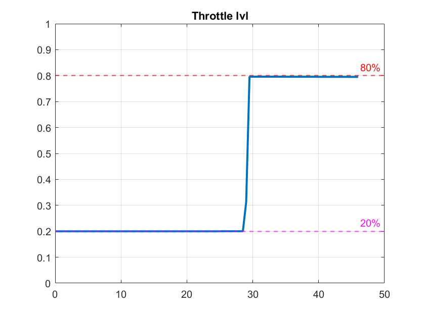
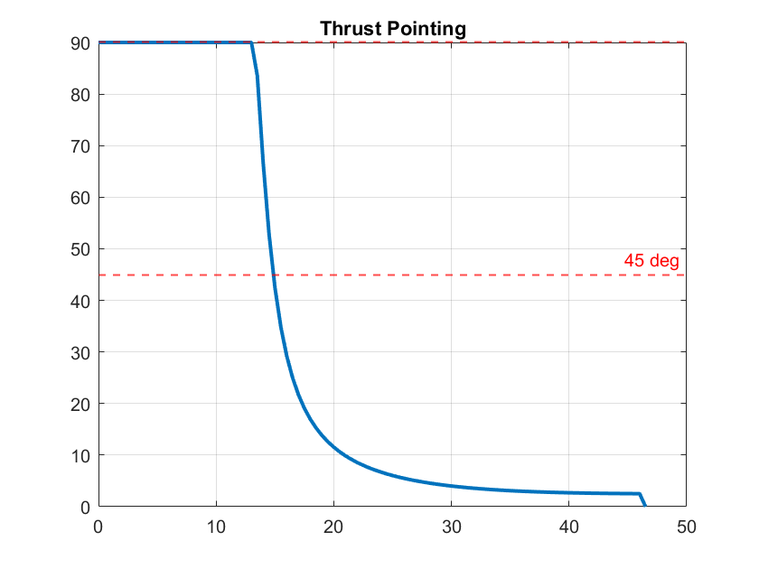
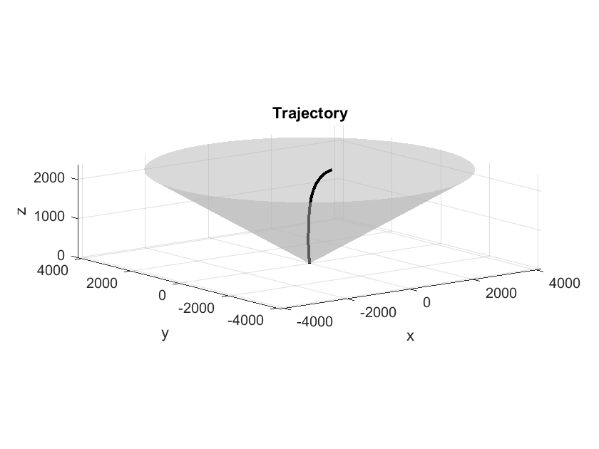
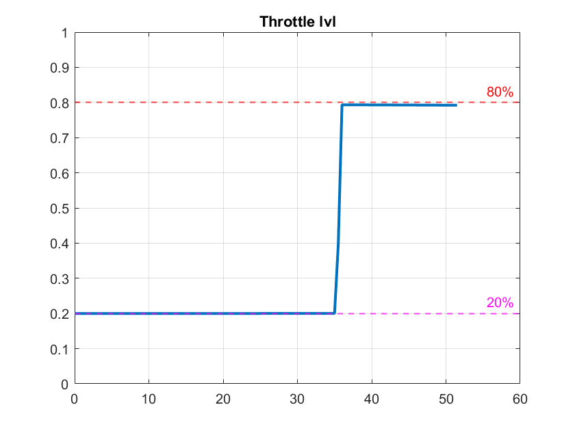
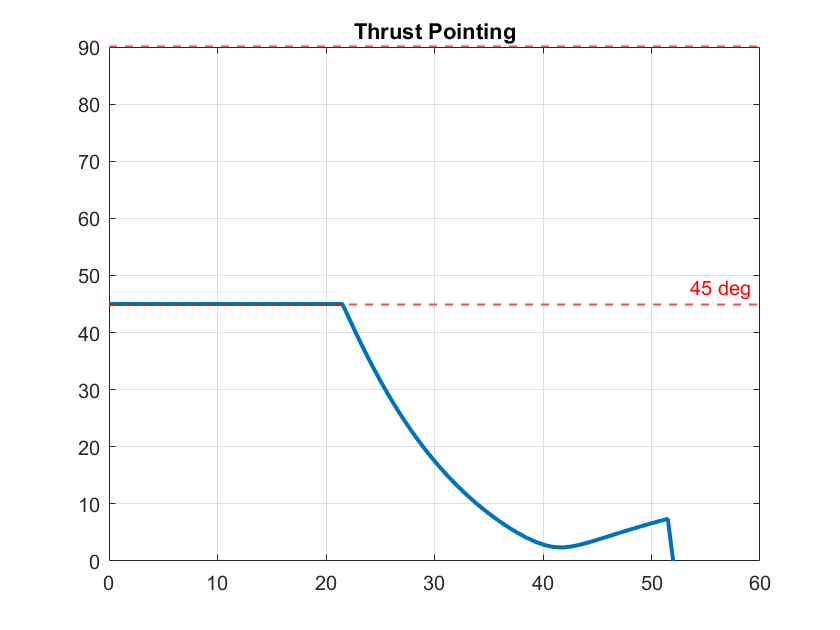
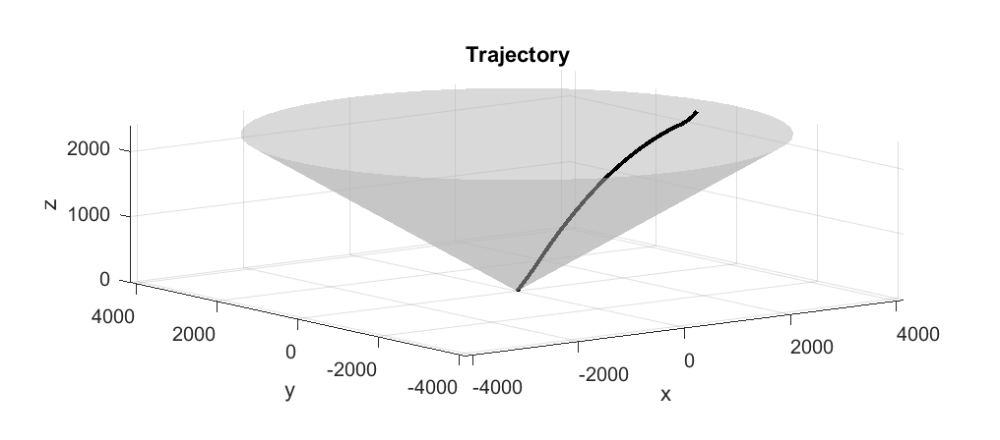
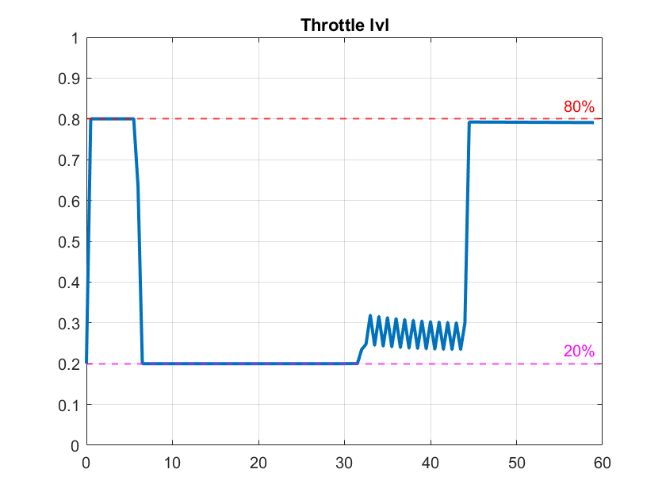
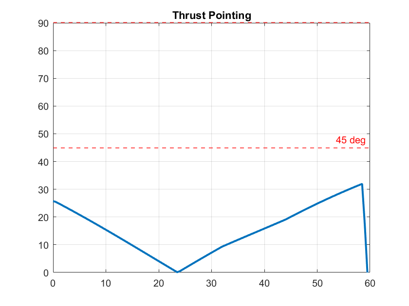

An implementation of the G-FOLD algorithm in Matlab using CVX. The plotted results for different examples are in the Figures folder.

## Dependencies:
- CVX version 2.2 (a convex programming toolbox for Matlab)
- Mosek version 10.1.28 (Optional, solver for the SOCP problem) 

## Run:
- Run init_opt.m

## Results:
### Case #1



### Case #2



### Case #3




## Reference:

Lossless Convexification of Nonconvex Control Bound and Pointing Constraints of the Soft Landing Optimal Control Problem

```
@article{accikmecse2013lossless,
  title={Lossless convexification of nonconvex control bound and pointing constraints of the soft landing optimal control problem},
  author={A{\c{c}}{\i}kme{\c{s}}e, Beh{\c{c}}et and Carson, John M and Blackmore, Lars},
  journal={IEEE transactions on control systems technology},
  volume={21},
  number={6},
  pages={2104--2113},
  year={2013},
  publisher={IEEE}
}
```

Convex Programming Approach to Powered Descent Guidance for Mars Landing
``` 
@article{acikmese2007convex,
  title={Convex programming approach to powered descent guidance for mars landing},
  author={Acikmese, Behcet and Ploen, Scott R},
  journal={Journal of Guidance, Control, and Dynamics},
  volume={30},
  number={5},
  pages={1353--1366},
  year={2007}
}
```

